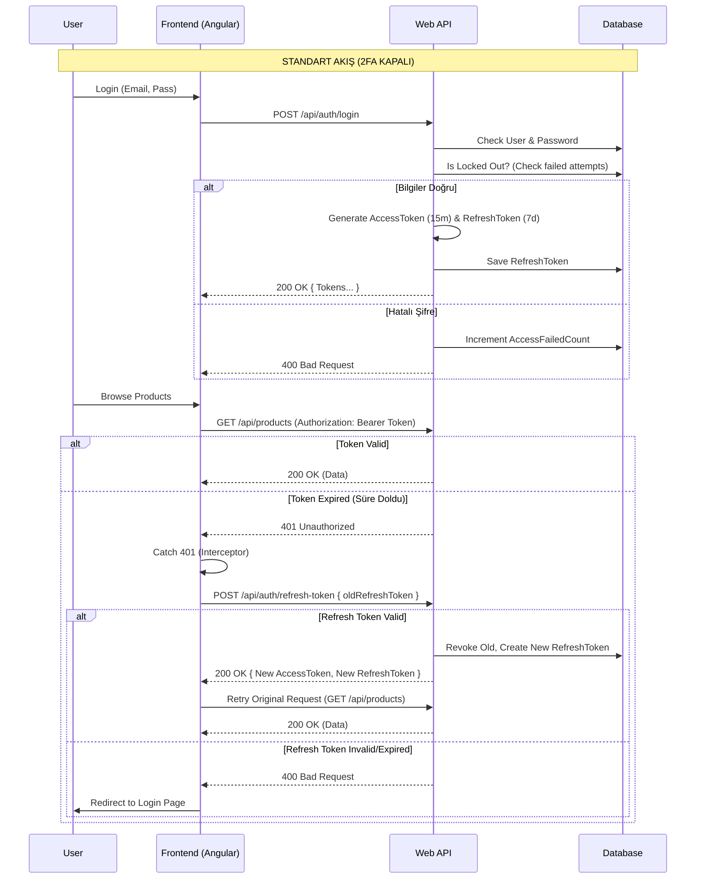
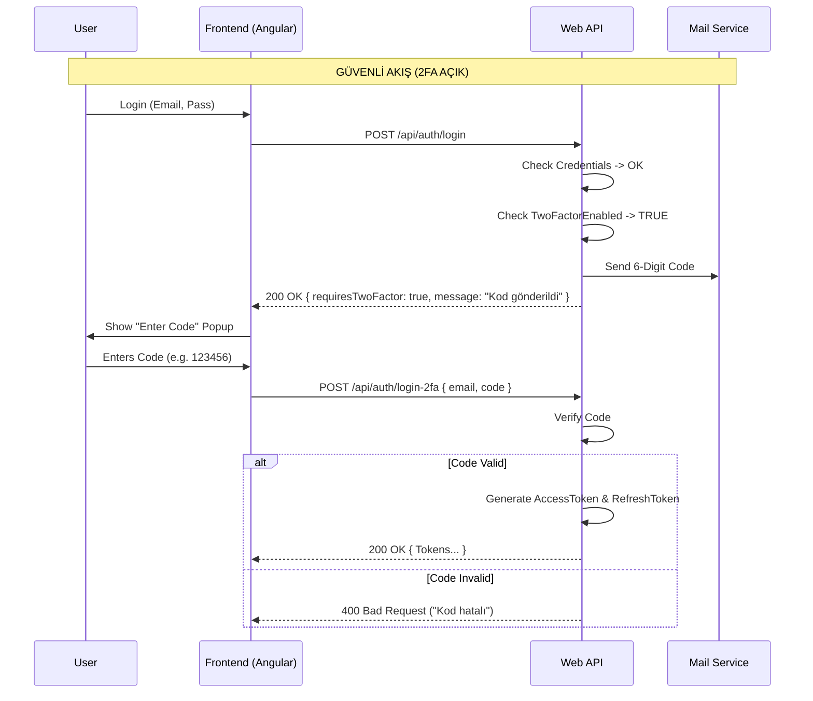

A. Standart Login & Refresh Akışı (Senaryo A)

```mermaid
sequenceDiagram
    participant User
    participant Angular as Frontend (Angular)
    participant API as Web API
    participant DB as Database

    Note over User, DB: STANDART AKIŞ (2FA KAPALI)

    User->>Angular: Login (Email, Pass)
    Angular->>API: POST /api/auth/login
    API->>DB: Check User & Password
    API->>DB: Is Locked Out? (Check failed attempts)
    
    alt Bilgiler Doğru
        API->>API: Generate AccessToken (15m) & RefreshToken (7d)
        API->>DB: Save RefreshToken
        API-->>Angular: 200 OK { Tokens... }
    else Hatalı Şifre
        API->>DB: Increment AccessFailedCount
        API-->>Angular: 400 Bad Request
    end

    User->>Angular: Browse Products
    Angular->>API: GET /api/products (Authorization: Bearer Token)
    
    alt Token Valid
        API-->>Angular: 200 OK (Data)
    else Token Expired (Süre Doldu)
        API-->>Angular: 401 Unauthorized
        Angular->>Angular: Catch 401 (Interceptor)
        Angular->>API: POST /api/auth/refresh-token { oldRefreshToken }
        
        alt Refresh Token Valid
            API->>DB: Revoke Old, Create New RefreshToken
            API-->>Angular: 200 OK { New AccessToken, New RefreshToken }
            Angular->>API: Retry Original Request (GET /api/products)
            API-->>Angular: 200 OK (Data)
        else Refresh Token Invalid/Expired
            API-->>Angular: 400 Bad Request
            Angular->>User: Redirect to Login Page
        end
    end
```

B. 2FA Login Akışı (Senaryo B)

```mermaid
sequenceDiagram
    participant User
    participant Angular as Frontend (Angular)
    participant API as Web API
    participant Mail as Mail Service

    Note over User, Mail: GÜVENLİ AKIŞ (2FA AÇIK)

    User->>Angular: Login (Email, Pass)
    Angular->>API: POST /api/auth/login
    API->>API: Check Credentials -> OK
    API->>API: Check TwoFactorEnabled -> TRUE
    
    API->>Mail: Send 6-Digit Code
    API-->>Angular: 200 OK { requiresTwoFactor: true, message: "Kod gönderildi" }
    
    Angular->>User: Show "Enter Code" Popup
    User->>Angular: Enters Code (e.g. 123456)
    
    Angular->>API: POST /api/auth/login-2fa { email, code }
    API->>API: Verify Code
    
    alt Code Valid
        API->>API: Generate AccessToken & RefreshToken
        API-->>Angular: 200 OK { Tokens... }
    else Code Invalid
        API-->>Angular: 400 Bad Request ("Kod hatalı")
    end
```
